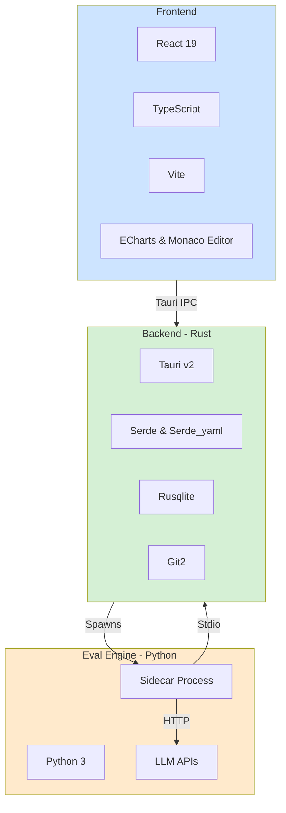

# Skillar (MySkills Manager) - README


<p align="center">
  
</p>

<h1 align="center">Skillar (MySkills Manager)</h1>

<p align="center">
  一个面向 AI Skills 的本地桌面管理器，提供统一管理、跨工具同步、使用追踪、冲突治理和自动化评估的能力。
</p>

---

## TL;DR

如果你和我一样，在日常开发中同时使用好几个 AI 编程工具（比如 Cursor、Antigravity），你可能也受够了在不同工具间同步和管理那些自定义指令（Skills）的麻烦。Skillar 就是为了解决这个“Skill 碎片化”的问题而生的。它是一个用 Rust 和 TypeScript 写的桌面小工具，主要帮你做几件事：

- **统一管理**：将分散的 Skills 聚合到一个由 Git 版本控制的中心目录。
- **自动同步**：通过符号链接（symlink）或文件拷贝（copy）模式，将中央仓库的 Skills 变更实时同步到各个工具。
- **洞察效果**：通过内置的仪表盘和日志浏览器，追踪和分析每个 Skill 的实际使用频率和场景。
- **解决冲突**：自动检测并提供可视化界面，以解决不同工具中存在的同名但内容不同的 Skill 冲突。
- **评估质量**：内置强大的五维评估引擎，通过自动化测试用例，量化评估 Skill 的触发准确率、功能正确性、鲁棒性等关键指标。

这个项目不只是个工具，更是我个人探索如何将 AI 辅助开发这套工作流做得更系统、更工程化的一次尝试。它的核心目标是帮助用户实现对 AI 技能的**精通与掌控**。

## 为什么需要 Skillar：Skill 的工程本质

理解 Skillar 的价值，首先需要理解 **Skill** 在 AI Agent 系统中的工程本质。

在当今的 Agent 架构中，Skill 不是随手写的一段 prompt，而是对 AI 行为的一次**精准编程**——每个 Skill 本质上是一个结构化的指令模块，用于约束和增强 AI 在特定场景下的行为。它是 Agent 能力的**原子单元**，是人类意志在 AI 系统中的最小可执行表达。

这意味着 Skill 具有与代码相同的工程属性：它需要被版本控制、被测试验证、被跨环境复用、被持续迭代。然而，当前的现实是，同一个开发者的 Skill 往往碎片化地散落在 Cursor、Claude Code、Codex 等不同工具的配置目录中，缺乏统一的管理、同步和质量保证。

**Skillar 正是为此而生的工程基础设施。** 如果说每个 Skill 是一段“程序”，那么 Skillar 就是管理这些程序的 **IDE**——它提供了版本控制（Git 集成）、质量保证（五维评估引擎）、可观测性（数据看板）和跨平台分发（同步引擎）的完整工具链。Skill 的工程本质与 Skillar 的产品定位是完全同构的。

## 设计哲学：三大支柱

Skillar 的产品设计遵循三条核心原则：

| 原则 | 描述 | 哲学内涵 |
| :--- | :--- | :--- |
| **统一 (Unify)** | 将散落的技能汇集到单一来源。 | **主权意识**：我的能力由我定义，工具只是载体。 |
| **洞察 (Insight)** | 提供数据驱动的分析与评估。 | **迭代进化**：经营一套由可观测性驱动、不断进化的个人能力体系。 |
| **掌控 (Mastery)** | 赋予用户对技能生态的完全控制。 | **所有权**：人是 AI 能力的最终定义者和裁决者，知识库归属于自己。 |

这三条原则贯穿了 Skillar 的所有功能设计。


## 核心能力

Skillar 的功能围绕着 AI Skill 的整个生命周期，从创建、同步到评估和迭代。整个应用可以拆成下面几个主要部分，它们都通过 Tauri 的 `invoke_handler` 暴露接口给 React 前端调用。

### 1. 技能与工具管理 (Skill & Tool Hub)

这是 Skillar 的核心。最新版本将原先独立的“技能”和“工具”页面合并为一个统一的“技能与工具”中心，通过 Tab 切换，提供了一个集中管理所有 AI 辅助资产的工作台。


- **中央技能库**: 扫描并管理一个本地目录（默认为 `~/my-skills`）作为所有 Skills 的单一事实来源。每个 Skill 是一个包含 `SKILL.md` 的子目录。
- **元数据驱动**: 内置 Monaco 编辑器，支持直接在应用内编辑 `SKILL.md` 的 YAML frontmatter，包括 `category`, `tags`, `my_notes` 等字段，方便组织和检索。
- **多维分类体系 (Taxonomy System)**: 除了基础的标签，Skillar 引入了一套复杂、多维度的技能分类体系。它集成了多种业界和学界的分类标准（如 `SoK`, `Anthropic`, `SkillsBench`），允许用户在技能列表中根据不同标准进行筛选和分组，极大地提升了技能的组织和发现能力。
- **多工具支持**: 内置对多种主流 AI 编程工具的支持，如 Antigravity, Codex, Cursor 等。通过 `src-tauri/src/setup/tool_registry.rs` 中的注册表进行管理，易于扩展。
- **智能路径探测**: 自动探测各工具的安装路径和 Skills 目录，同时允许用户在设置页面手动覆盖路径，提供了极高的灵活性。
- **双模同步引擎**: 
    - **符号链接 (Symlink)**: 默认模式，性能最高。直接将中央仓库的 Skill 目录链接到工具的目标路径。任何对源文件的修改都会即时反映到所有工具中。
    - **文件拷贝 (Copy)**: 当符号链接因权限或其他原因不可用时，自动回退到文件拷贝模式。Skillar 会将被修改的 Skills 复制到目标工具目录。
- **可视化冲突治理**: 之前发现冲突只是给个 Diff 视图，还是不太好用。现在我专门做了个“冲突概览面板”（`SkillsOverviewPanel`）和一个抽屉式的“冲突解决工作区”（`SkillConflictDrawer`）。你可以在一个地方看到所有冲突的 Skill，然后一个个处理，管理版本冲突比以前简单多了。

| 同步状态 | 描述 |
| :--- | :--- |
| **已同步 (Synced)** | 工具中的 Skill 与中央仓库的 `SKILL.md` 文件哈希值一致。 |
| **未收录 (Missing)** | 中央仓库中存在的 Skill 未在工具中找到。 |
| **内容冲突 (Conflict)** | 工具中的 Skill 与中央仓库的同名 Skill 哈希值不一致，意味着内容被外部修改。 |


### 2. 技能评估工作台 (Evaluation Workbench)

一个 Skill 到底好不好用，怎么量化？我把评估流程整个重构成了一个“评估工作台”，不再是之前的一条路走到黑，而是拆成了四个独立的视图，覆盖了从配置、运行到分析、评审的全过程。

它采用 **Rust + Python 混合架构**，以兼顾性能与灵活性：

- **Rust 主控流程**：整个评估流水线（Pipeline）的调度、并发控制、数据处理、指标计算和报告生成完全由 Rust（`src-tauri/src/evals/mod.rs`）实现。这确保了评估过程的高性能和稳定性，并能与 Tauri 前端进行高效的事件通信（如实时进度更新）。
- **Python 计算核心**：对于最核心的、与大语言模型（LLM）交互的“评判（Judge）”环节，Skillar 通过 Tauri 的 **Sidecar** 模式调用一个独立的 Python 进程。这巧妙地将 Python 在 AI 生态中的优势（丰富的库、成熟的工具链）与 Rust 的工程优势结合起来，同时隔离了复杂的 Python 依赖，使主应用保持轻量。


- **五维评估模型**: 评估框架围绕五个核心维度展开，提供对 Skill 质量的全面度量：
    1.  **触发准确性 (Trigger Accuracy)**: Skill 是否在应该触发时触发，在不该触发时保持静默？通过精确率 (Precision)、召回率 (Recall) 和误报率 (FPR) 等指标来衡量。
    2.  **功能正确性 (Functional Correctness)**: Skill 的输出是否符合预期？通过运行一系列带断言的测试用例来验证。
    3.  **鲁棒性 (Robustness)**: 在面对边缘情况、模糊输入或不同措辞时，Skill 的表现是否稳定？
    4.  **效率 (Efficiency)**: Skill 的执行效率如何？（未来规划，当前版本暂未完全实现）
    5.  **增益价值 (Value Added)**: 与不使用该 Skill 的情况相比，它带来了多大的改进？通过对比实验来量化。

- **自动化测试用例生成**: 缺乏测试数据是评估的起点。Skillar 提供了一个“样本生成”功能，可以基于 `SKILL.md` 的内容，利用大语言模型自动生成一批高质量的触发测试用例（判断是否应该触发）和功能测试用例（测试具体功能），大大降低了评估的启动门槛。

- **多种评估模式**: 
    - **快速模式 (Quick)**: 仅运行触发测试和基本的结构检查，速度快，成本低，适合快速迭代和冒烟测试。
    - **标准模式 (Standard)**: 运行完整的五维评估，但使用单一判定模型，在成本和全面性之间取得平衡。
    - **全面模式 (Full)**: 使用多个判定模型对结果进行交叉验证，并进行多轮重复测试以获取统计上更可靠的结果，最全面也最昂贵。

- **评估工作台视图**:
    - **设置 (Setup)**: 在这里配置评估流水线的所有参数，包括选择要评估的 Skill、评估模式、测试数据集、LLM 模型、API 密钥、预算上限等。
    - **运行 (Run)**: 启动评估后，此视图会实时展示评估进度、当前执行的任务、耗时和成本等动态信息。
    - **结果 (Results)**: 评估完成后，生成一份包含各项 KPI、图表、详细结果列表和成本估算的报告。所有历史报告都会被保存，方便进行纵向对比，追踪 Skill 的改进历程。
    - **评审 (Review)**: 这块是这次更新我最花心思的地方。它允许你对机器跑出来的评估结果进行人工审核和干预。

- **人工评审与计分卡 (Manual Review & Scorecard)**: 在“评审”视图中，你可以：
    - **覆盖结论**: 如果不认同 AI 的自动评判结果，可以手动覆盖最终的通过/失败结论。
    - **添加评语**: 记录下你对本次评估的分析、发现的问题或改进建议。
    - **评估计分卡**: 通过一个包含多个维度的雷达图和星级评分，对 Skill 的质量给出一个更直观、更人性化的综合评分。

有了这个评估工作台，调教 Skill 就不再是纯凭手感了，而是真正进入了“数据驱动+专家经验”的工程化阶段。这也是 Skillar 最硬核的功能之一。


### 3. 数据看板与日志浏览器

为了搞清楚这些 Skills 到底用得怎么样，Skillar 提供了一套数据看板和查询工具。

- **数据看板 (Dashboard)**: 这是你的 Skill 使用情况的指挥中心。通过一系列 KPI 卡片和 ECharts 图表，直观展示：
    - **核心指标**: 总调用次数、活跃 Skill 数量、未使用 Skill 数量等。
    - **Top Skills**: 最常被调用的 Skill 列表，帮你识别最有价值的指令。
    - **工具分布**: Skill 调用在不同 AI 工具中的分布情况。
    - **每日趋势**: 按天聚合的调用量变化，观察你的工作模式。
    - **时间窗口**: 支持按最近 7 天、30 天、90 天筛选数据。
    - **使用洞察 (Usage Insights)**: 在技能列表页面，每个 Skill 旁边都会展示其 D7/D30/D90 的使用频次和趋势，以及最近一次的评估结果摘要，让你对每个 Skill 的“健康度”一目了然。这部分逻辑由 `skill_insights.rs` 模块驱动。

- **日志浏览器 (Logs)**: 提供对原始使用日志 (`skill-usage.jsonl`) 的分页、筛选和查询功能。你可以根据 Skill 名称、工具、时间范围等条件精确查找每一次调用的详细记录。

- **高性能日志索引**: 为了在数万甚至数十万行日志中实现毫秒级查询，Skillar 在后台使用 `rusqlite` 为 `skill-usage.jsonl` 文件创建了一个 SQLite 索引 (`skill-usage-index.sqlite3`)。当日志文件更新时，索引会自动增量更新，确保了前端查询的流畅体验。这部分逻辑在 `src-tauri/src/log_index.rs` 中实现。

### 4. Git 集成面板

既然 `my-skills` 目录本身就是个 Git 仓库，那在应用里直接提供一套 Git 工作流就显得很自然了。Git 面板就是一个轻量级的 Git 客户端。

- **多仓库管理**: 你可以添加和管理多个 Git 仓库，不仅仅是 `my-skills`，也可以是你的笔记库、代码项目等。每个仓库都可以独立配置其远端 URL、本地路径和同步模式。
- **状态概览**: 清晰地展示当前分支、已修改、已暂存和未跟踪的文件列表。
- **核心 Git 操作**: 支持在应用内直接执行 `commit` 和 `push` 操作，简化了版本控制流程。
- **提交历史与图谱**: 查看近期的提交历史，并能以图形化的方式展示分支和合并情况。
- **目录内容同步**: 对于采用“安全镜像”模式的仓库，可以一键将源目录的内容同步到 Git 仓库目录中，并可以配置忽略特定文件或目录。


### 5. 统一的配置与引导流程

- **首次启动向导 (Onboarding Wizard)**: 第一次用的时候，会有一个设置向导，带你一步步设置好 Skills 的根目录、同步模式，还能一键把你已经装好的工具里的 Skills 都导进来，无痛上手。
- **设置中心 (Settings Page)**: 所有应用级别的配置，比如 Skills 目录、主题、语言、API 密钥这些，都在一个统一的设置页面里管理。
- **自动更新检查**: 应用内置了更新检查模块（`update_checker.rs`），可以定期检查新版本，并在发现版本跳跃时（例如从 0.1.x 更新到 0.2.x），主动展示相关的发布说明。

### 6. VS Code 扩展 (IDE 集成)

除了主桌面应用，Skillar 还提供了一个配套的 **VS Code 扩展**，将核心体验无缝集成到你的日常开发环境中。

- **侧边栏仪表盘**: 在 VS Code 的活动栏中增加一个 Skillar 图标，点击即可打开一个 Webview 构成的仪表盘。
- **技能浏览器**: 无需离开编辑器，即可浏览、搜索和打开你的 `my-skills` 目录下的所有技能。
- **Git 面板集成**: 直接在 VS Code 的仪表盘中查看 Git 仓库状态、暂存文件、提交和推送，功能与主应用中的 Git 面板保持同步。
- **自动安装与配置**: Skillar 桌面应用可以一键为 VS Code 安装或卸载此扩展，并自动将 `my-skills` 的路径同步到 VS Code 的配置中，实现真正的开箱即用。这部分复杂的跨应用交互逻辑由 `vscode_extension.rs` 模块处理。

## 技术架构

Skillar 用的是一套比较现代的跨平台桌面应用技术栈，主要是为了性能、UI体验和系统集成。



- **前端 (Frontend)**: 使用 **React 19.2.0** 和 **TypeScript** 构建，由 **Vite** 提供开发和构建支持。UI 层面，集成了 **ECharts** 用于数据可视化（仪表盘），以及 **Monaco Editor** 提供一流的代码和文本编辑体验（技能编辑器）。

- **后端 (Backend)**: 核心业务逻辑完全由 **Rust** (2021 Edition, `1.77.2`) 实现，并基于 **Tauri v2** 框架构建。这带来了接近本机的性能和极低的内存占用。
    - **`serde` / `serde_yaml`**: 用于高效、安全地处理各类配置文件（JSON, YAML）的序列化和反序列化。
    - **`rusqlite`**: 用于创建和管理本地 SQLite 数据库，为日志查询提供高性能索引。
    - **`git2`**: 提供了对 Git 仓库的底层操作能力，是 Git 面板功能的基石。
    - **Tauri API**: 通过 `invoke` 机制，Rust 后端将一系列原子化的能力（如 `skills_list`, `git_status`, `run_eval_pipeline`）暴露给前端，实现了前后端的清晰分离。

- **评估引擎 (Eval Engine)**: 采用 **Rust + Python 混合架构**。Rust 负责整个评估流程的编排、并发控制和指标计算，而 Python Sidecar 则专注于执行与 LLM 的交互，实现了性能和灵活性的平衡。

## 内置工具支持

Skillar 内置了对多个主流 AI 辅助编程工具的开箱即用支持。下表列出了这些工具及其默认的 Skills 和规则文件路径。所有路径中的 `~` 均表示用户主目录。

| 工具 (Tool) | ID | 默认 Skills 目录 | 默认 Rules 文件 |
| :--- | :--- | :--- | :--- |
| Antigravity | `antigravity` | `~/.gemini/antigravity/skills` | `~/.gemini/GEMINI.md` |
| Codex | `codex` | `~/.codex/skills` | `~/.codex/AGENTS.md` |
| Claude Code | `claude-code` | `~/.claude/skills` | `~/.claude/CLAUDE.md` |
| Cursor | `cursor` | `~/.cursor/skills` | `~/.cursor/rules/myskills-tracker.mdc` |
| Windsurf | `windsurf` | `~/.codeium/windsurf/skills` | `~/.codeium/windsurf/memories/global_rules.md` |
| Trae | `trae` | `~/.trae/skills` | `~/.trae/AGENTS.md` |
| OpenCode | `opencode` | `~/.config/opencode/skills` | `~/.config/opencode/AGENTS.md` |

> **说明**: Skillar 会自动探测工具的备用路径（例如 `~/.windsurf/skills`）。如果你的工具安装在非标准位置，你可以在 **工具 (Tools)** 页面的路径设置中手动覆盖这些默认值。


## 快速开始

你可以通过两种方式运行 Skillar：直接下载预编译的可执行文件，或者从源码构建。

### 1. 直接下载 (推荐)

对大部分人来说，最省事儿的办法就是直接从 GitHub Releases 页面下载编译好的安装包。

1.  访问 [**GitHub Releases**](https://github.com/KeithChen51/MySkills-Manager/releases/latest)。
2.  下载适用于你操作系统的安装包（例如 `Skillar_*.msi` for Windows）。
3.  运行安装程序或直接启动可执行文件。

### 2. 从源码运行

如果你想改代码或者给项目做贡献，可以从源码启动。

**前置依赖:**

-   **Node.js**: v20.19+ 或 v22.12+
-   **Rust**: `stable` toolchain (项目当前使用 `1.77.2`)
-   **Tauri CLI**: `v2` (通过 `cargo install tauri-cli --version "^2"` 安装)

**步骤:**

```bash
# 1. 克隆仓库
git clone https://github.com/KeithChen51/MySkills-Manager.git
cd MySkills-Manager

# 2. 安装前端依赖
npm install

# 3. 启动开发模式
cargo tauri dev
```

这个命令会同时跑起 Vite 前端开发服务器和 Tauri 的 Rust 后端，然后打开桌面应用窗口。改了前端代码，页面会自动刷新。

## 开发与构建

为了方便开发，`package.json` 里预设了一些脚本：

| 命令 | 说明 |
| :--- | :--- |
| `npm run dev` | 仅启动 Vite 前端开发服务器，用于纯前端调试。 |
| `npm run build` | 构建生产版本的前端代码到 `dist` 目录。 |
| `npm run build:desktop` | 完整构建 Tauri 桌面应用（适用于当前操作系统）。 |
| `npm run lint` | 使用 ESLint 检查代码风格。 |
| `npx tsx --test test/*.test.ts` | 运行前端和脚本相关的单元测试（使用 Node.js test runner）。 |
| `cargo test --manifest-path src-tauri/Cargo.toml` | 运行 Rust 后端的单元测试和集成测试。 |

## 目录结构

```text
myskills-manager/
├── src/                     # React + TypeScript 前端代码
│   ├── api/                 # Tauri invoke API 封装
│   ├── components/          # 可复用 React 组件
│   ├── domain/              # 前端领域逻辑（如 diff 计算、数据转换）
│   ├── i18n/                # 国际化（中/英文）文案
│   ├── pages/               # 各个页面的主组件 (Skills, Tools, Dashboard...)
│   └── workers/             # Web Worker 脚本 (如用于后台 diff 计算)
├── src-tauri/               # Rust 后端与 Tauri 配置
│   ├── py/                  # Python 评估引擎 (Sidecar)
│   │   └── eval_engine/
│   ├── src/
│   │   ├── setup/           # 重构后的设置与同步引擎，包含 apply_engine.rs, router_health.rs 等模块
│   │   ├── evals/           # 评估引擎的 Rust 核心模块，包含 types.rs 和巨大的 mod.rs
│   │   ├── git.rs           # Git 面板后端逻辑
│   │   ├── log_index.rs     # SQLite 日志索引
│   │   ├── skills.rs        # SKILL.md 读写与元数据解析
│   │   ├── logs.rs          # 日志处理与分析新模块
│   │   ├── log_parse.rs     # 日志解析逻辑
│   │   ├── skill_insights.rs # 技能使用洞察与趋势分析
│   │   ├── router_seed.rs   # 路由种子配置生成
│   │   ├── vscode_extension.rs # VS Code 扩展管理
│   │   ├── update_checker.rs # 自动更新检查
│   │   └── main.rs          # 应用入口
│   └── tauri.conf.json      # Tauri 应用主配置
├── vscode-extension/        # VS Code 扩展源码
├── test/                    # 前端单元测试
└── scripts/                 # Node.js 构建与发布脚本
```

## 贡献

欢迎各种形式的贡献！不管是提 issue、修 bug 还是加新功能，都非常欢迎。动手前可以先看看相关的开发文档，保证代码风格和测试能通过就行。

---

<p align="center">Built with ❤️ by Keith</p>
