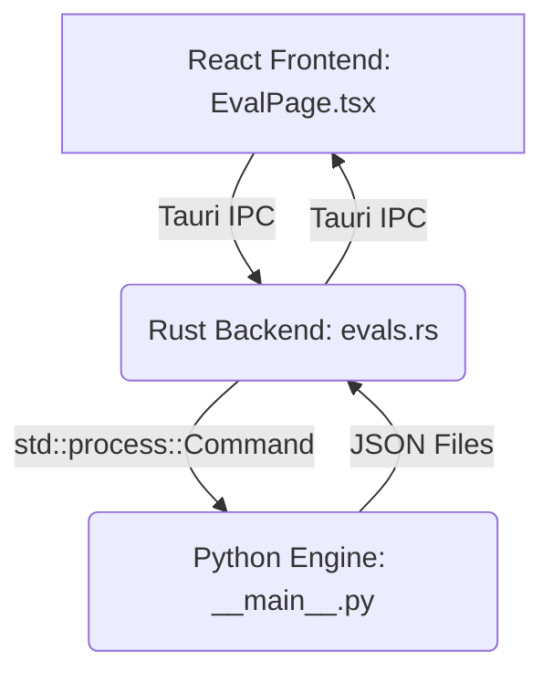

# Skill Evaluator MVP: Integration Guide

## 1. Overview

This document outlines the architecture and integration path for the Skill Evaluator module's Minimum Viable Product (MVP) within the Skillar (MySkills-Manager) application. The goal of this MVP is to establish the foundational structure for evaluating AI Agent Skills, from the user interface down to the evaluation engine.

## 2. Architecture

The Skill Evaluator follows a three-layer architecture designed for modularity and separation of concerns:

1.  **React Frontend**: A new `EvalPage` provides the user interface for configuring and viewing evaluations.
2.  **Rust/Tauri Backend**: A new `evals.rs` module in the Tauri core acts as a bridge, handling requests from the frontend and invoking the Python evaluation engine.
3.  **Python Evaluation Engine**: A self-contained Python module (`py/eval_engine`) executes the core evaluation logic, communicating with the Rust backend via standard I/O and JSON files.

## 3. Component Breakdown

### 3.1. Frontend (`/src`)

-   **`pages/EvalPage.tsx`**: The main component for the evaluator UI. It manages state for skill selection, evaluation mode, and displaying results. Currently, it uses mock data to render the UI.
-   **`pages/EvalPage.css`**: Styles specific to the `EvalPage`.
-   **`components/Sidebar.tsx`**: Modified to include a new "Eval" navigation item in the sidebar.
-   **`components/icons.tsx`**: A new `IconEval` (FlaskConical) has been added for the navigation item.
-   **`App.tsx`**: Modified to include the `EvalPage` in the main view router.
-   **`i18n/messages.ts`**: New English and Chinese translations for all UI elements on the `EvalPage` have been added.

### 3.2. Backend (`/src-tauri/src`)

-   **`evals.rs`**: This new Rust module defines the backend logic.
    -   It exposes two Tauri commands: `run_trigger_eval` and `run_functional_eval`.
    -   It uses `std::process::Command` to execute the Python evaluation engine as a separate process.
    -   It passes all necessary arguments (skill name, file paths, API keys, etc.) to the Python script via command-line flags.
    -   It reads the JSON output file produced by the Python script and returns the deserialized result to the frontend.
-   **`lib.rs`**: Modified to declare the `evals` module and register its Tauri commands in the `invoke_handler`.

### 3.3. Python Evaluation Engine (`/src-tauri/py/eval_engine`)

This is the core of the evaluation logic, designed to be runnable as a standalone CLI tool.

-   **`__main__.py`**: The main entry point. It uses `argparse` to handle different sub-commands (`trigger`, `functional`) and their respective arguments. It orchestrates the call to the appropriate evaluation module.
-   **`trigger_eval.py`**: Contains the (currently mocked) logic for trigger accuracy tests. It simulates making an LLM call and checking if the correct skill was invoked.
-   **`functional_eval.py`**: Contains the (currently mocked) logic for functional correctness tests. It simulates running a skill, generating output, and then grading that output against a set of assertions.
-   **`schemas/`**: This directory contains JSON Schema definitions for the inputs and outputs of the evaluation scripts, ensuring a clear and validated contract between the Python engine and its callers.

## 4. Data Flow

1.  The user selects a skill and clicks "Run Evaluation" on the `EvalPage`.
2.  The `handleRunEval` function (currently a mock) will call the new Tauri commands (e.g., `run_trigger_eval`).
3.  The Rust command in `evals.rs` assembles the necessary arguments and spawns the Python script (`python3 -m eval_engine trigger ...`).
4.  The Python script (`__main__.py`) parses the arguments and calls the corresponding evaluation function (e.g., `trigger_eval.run()`).
5.  The evaluation function performs its tests (simulated in this MVP) and writes the results to a JSON file at the specified output path.
6.  The Rust command, after the Python process completes, reads the result from the JSON file.
7.  Rust deserializes the JSON into its corresponding Rust struct and returns it to the frontend.
8.  The `EvalPage` receives the data, updates its state, and renders the results in charts and tables.

## 5. Next Steps for MVP Completion

The current implementation establishes the complete end-to-end structure with mocked logic in the Python engine. The immediate next steps are:

1.  **Implement Real LLM Calls**: Replace the mock logic in `trigger_eval.py` and `functional_eval.py` with actual API calls to a generic LLM service (e.g., using the `openai` or `anthropic` Python libraries).
2.  **Implement Grader Agent**: Build out the `grader.py` module (currently placeholder) to use an LLM-as-Judge pattern, based on the research from the `skill-creator` analysis.
3.  **Frontend Integration**: Wire up the `handleRunEval` function in `EvalPage.tsx` to call the actual Tauri commands and handle the returned data or errors.
4.  **File Management**: Ensure that temporary files for evaluation sets and results are managed correctly, likely within a dedicated subdirectory of the Skillar workspace (e.g., `~/.skillar/evals/`).
