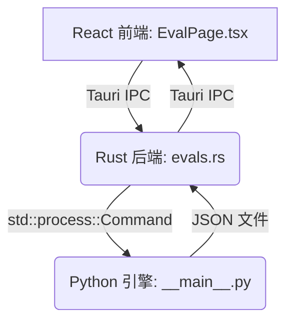

# Skill Evaluator MVP: 集成指南

## 1. 概述

本文档阐述了 Skill Evaluator 模块最低可行产品 (MVP) 在 Skillar (MySkills-Manager) 应用中的架构设计与集成路径。此 MVP 的目标是为评估 AI Agent Skills 建立从用户界面到评估引擎的基础结构。

## 2. 架构

Skill Evaluator 遵循一个为模块化和关注点分离而设计的三层架构：

1.  **React 前端**: 一个新的 `EvalPage` 页面，提供用于配置和查看评估结果的用户界面。
2.  **Rust/Tauri 后端**: Tauri 核心中的一个新 `evals.rs` 模块，作为桥梁，处理来自前端的请求并调用 Python 评估引擎。
3.  **Python 评估引擎**: 一个独立的 Python 模块 (`py/eval_engine`)，执行核心评估逻辑，通过标准 I/O 和 JSON 文件与 Rust 后端通信。

## 3. 组件分解

### 3.1. 前端 (`/src`)

-   **`pages/EvalPage.tsx`**: 评估器 UI 的主组件。它管理技能选择、评估模式和结果展示的状态。目前，它使用模拟数据来渲染 UI。
-   **`pages/EvalPage.css`**: `EvalPage` 的特定样式。
-   **`components/Sidebar.tsx`**: 已修改，在侧边栏中增加了一个新的“评测”导航项。
-   **`components/icons.tsx`**: 为导航项添加了一个新的 `IconEval` (FlaskConical) 图标。
-   **`App.tsx`**: 已修改，将 `EvalPage` 添加到主视图路由器中。
-   **`i18n/messages.ts`**: 为 `EvalPage` 上的所有 UI 元素添加了新的英文和中文翻译。

### 3.2. 后端 (`/src-tauri/src`)

-   **`evals.rs`**: 这个新的 Rust 模块定义了后端逻辑。
    -   它暴露了两个 Tauri 命令：`run_trigger_eval` 和 `run_functional_eval`。
    -   它使用 `std::process::Command` 将 Python 评估引擎作为独立进程执行。
    -   它通过命令行标志将所有必要的参数（技能名称、文件路径、API 密钥等）传递给 Python 脚本。
    -   它读取 Python 脚本生成的 JSON 输出文件，并将反序列化的结果返回给前端。
-   **`lib.rs`**: 已修改，声明 `evals` 模块并在 `invoke_handler` 中注册其 Tauri 命令。

### 3.3. Python 评估引擎 (`/src-tauri/py/eval_engine`)

这是评估逻辑的核心，设计为可作为独立的 CLI 工具运行。

-   **`__main__.py`**: 主入口点。它使用 `argparse` 来处理不同的子命令（`trigger`, `functional`）及其各自的参数。它协调对相应评估模块的调用。
-   **`trigger_eval.py`**: 包含触发准确性测试的（当前为模拟的）逻辑。它模拟进行 LLM 调用并检查是否调用了正确的技能。
-   **`functional_eval.py`**: 包含功能正确性测试的（当前为模拟的）逻辑。它模拟运行一个技能，生成输出，然后根据一组断言对该输出进行评分。
-   **`schemas/`**: 此目录包含评估脚本输入和输出的 JSON Schema 定义，确保 Python 引擎与其调用者之间有清晰且经过验证的契约。

## 4. 数据流

1.  用户在 `EvalPage` 上选择一个技能并点击“运行评估”。
2.  `handleRunEval` 函数（当前为模拟）将调用新的 Tauri 命令（例如 `run_trigger_eval`）。
3.  `evals.rs` 中的 Rust 命令组装必要的参数并生成 Python 脚本 (`python3 -m eval_engine trigger ...`)。
4.  Python 脚本 (`__main__.py`) 解析参数并调用相应的评估函数（例如 `trigger_eval.run()`）。
5.  评估函数执行其测试（在此 MVP 中为模拟）并将结果写入指定输出路径的 JSON 文件。
6.  Python 进程完成后，Rust 命令从 JSON 文件中读取结果。
7.  Rust 将 JSON 反序列化为其相应的 Rust 结构体并将其返回给前端。
8.  `EvalPage` 接收数据，更新其状态，并在图表和表格中渲染结果。

## 5. MVP 完成的后续步骤

当前的实现通过在 Python 引擎中使用模拟逻辑，建立了完整的端到端结构。接下来的步骤是：

1.  **实现真实的 LLM 调用**: 将 `trigger_eval.py` 和 `functional_eval.py` 中的模拟逻辑替换为对通用 LLM 服务（例如，使用 `openai` 或 `anthropic` Python 库）的实际 API 调用。
2.  **实现评分器 Agent**: 构建 `grader.py` 模块（当前为占位符），以使用基于 `skill-creator` 分析研究的 LLM-as-Judge 模式。
3.  **前端集成**: 连接 `EvalPage.tsx` 中的 `handleRunEval` 函数以调用实际的 Tauri 命令并处理返回的数据或错误。
4.  **文件管理**: 确保评估集和结果的临时文件得到正确管理，可能在 Skillar 工作区的专用子目录中（例如 `~/.skillar/evals/`）。
