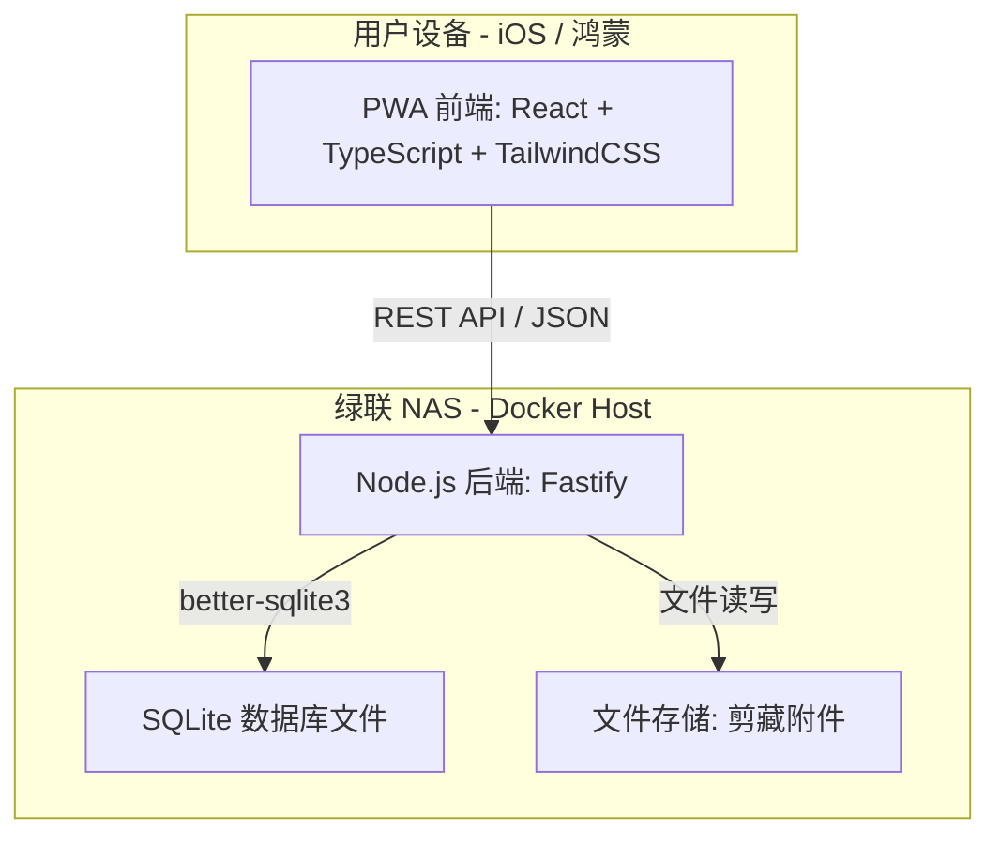

# “二人世界”私有应用设计文档

> **项目代号**: CoupleApp
> **日期**: 2026-03-16
> **作者**: Manus AI, in collaboration with Keith

## 1. 项目概述

本文档旨在为 Keith 和其妻子专属的私有化移动应用（代号 "CoupleApp"）提供全面的设计方案。该应用旨在通过一系列实用功能，增进夫妻二人的生活协同与情感联结。

经过与 Keith 的多轮沟通，我们确立了以下核心需求与设计原则：

| 维度 | 决策 |
| :--- | :--- |
| **目标用户** | Keith 及其妻子，仅限两人使用 |
| **核心价值** | 私密、专属、贴合生活节奏 |
| **部署方案** | **完全私有化**，后端服务及数据存储于用户的绿联 NAS |
| **客户端形态** | **PWA (Progressive Web App)**，以适应 iOS 和纯血鸿蒙系统 |
| **开发节奏** | 所有核心功能一次性开发完成 (MVP) |

### 功能范畴

应用将包含以下五个核心模块：

1.  **记账**：支持共同与个人账本，并包含预算管理功能。
2.  **剪藏**：一个全类型的私人知识库，用于收藏网页、图片、文字、文件等。
3.  **影视进度**：追踪两人共同观看的电视剧、电影系列、学习视频等的进度。
4.  **生理期记录**：基础的经期记录与周期预测。
5.  **锻炼记录**：简单的个人锻炼打卡。

## 2. 技术架构

我们选用**全栈 JavaScript** 方案，以最大化利用 Keith 现有的技术栈（Tauri, React, TS），降低学习成本，将开发重心聚焦于功能实现和体验打磨。

### 2.1. 架构图



### 2.2. 技术选型

| 层面 | 技术 | 理由 |
| :--- | :--- | :--- |
| **前端** | React + TypeScript + Vite | Keith 熟悉的技术栈，强大的生态系统。 |
| **UI 库** | TailwindCSS | 移动优先，原子化 CSS，便于快速构建自定义界面。 |
| **后端框架** | Fastify (Node.js) | 轻量、高性能，相比 Express 有更好的异步处理和 JSON Schema 验证。 |
| **数据库** | SQLite (via `better-sqlite3`) | 单文件数据库，零配置，备份简单，性能对两人应用绰绰有余。 |
| **部署** | Docker | 一次构建，到处运行。简化在 NAS 上的部署和管理。 |

## 3. 用户体验 (UX) 设计

### 3.1. 用户体系

为贯彻“两人专属”的理念，用户体系将极度简化：

- **无注册流程**：在数据库中直接预置两个用户（例如：`keith`, `wife`）。
- **登录方式**：通过简单的 PIN 码或密码区分当前操作用户。

### 3.2. 导航结构

应用采用底部 Tab 栏作为主导航，包含 5 个核心入口：

| Tab | 图标建议 | 对应模块 | 核心功能 |
| :--- | :--- | :--- | :--- |
| **首页** | 仪表盘 | 概览 | 今日支出、锻炼状态、生理期倒计时、在追内容速览 |
| **记账** | 钱包 | 记账模块 | 记录开支、查看报表 |
| **剪藏** | 书签 | 剪藏知识库 | 收藏内容、按标签查看 |
| **追踪** | 播放列表 | 影视进度 | 管理共同观看内容的进度 |
| **我的** | 用户头像 | 个人中心 | 锻炼打卡、生理期记录、设置 |

## 4. 模块详细设计

### 4.1. 记账模块

- **核心功能**：支持“共同账本”和“个人账本”；月度预算设定与提醒。
- **交互设计**：
    1.  **记一笔**：悬浮按钮触发，三步（选分类 → 输金额 → 选账本）完成。
    2.  **月度总览**：提供分类饼图、预算进度条。
    3.  **流水明细**：支持按账本和分类筛选。

### 4.2. 剪藏模块

- **核心功能**：支持链接、文字、图片、文件等多种类型内容的收藏。
- **组织方式**：采用扁平化的**标签系统**进行分类，支持全文搜索。
- **特色功能**：利用 PWA 的 Web Share Target API，实现从手机浏览器一键分享内容到应用内。

### 4.3. 影视进度模块

- **核心功能**：统一管理两人共同观看内容的进度。
- **交互设计**：
    1.  **卡片式布局**：每个追踪项为一个卡片，包含封面、标题、进度条。
    2.  **一键更新**：在卡片上提供 `+1` 按钮，快速将进度推进一集/一章。

### 4.4. 生理期模块

- **核心功能**：记录经期开始/结束日期，自动推算平均周期并预测下次日期。
- **隐私设计**：
    - **数据隔离**：该模块仅在妻子的账户下可见和操作。
    - **信息共享**：首页的倒计时提醒（如“距离下次还有 X 天”）两人均可见，体现关心。

### 4.5. 锻炼记录模块

- **核心功能**：纯粹的个人锻炼打卡，不引入社交和评比元素。
- **交互设计**：
    1.  **快速打卡**：选择锻炼类型即可完成打卡。
    2.  **日历视图**：在个人日历上标记已打卡日期。
    3.  **月度统计**：展示本月总打卡天数和各类型分布。

## 5. 数据模型 (SQLite Schema)

```sql
-- 用户表 (预置两条数据)
CREATE TABLE users (
    id INTEGER PRIMARY KEY AUTOINCREMENT,
    username TEXT NOT NULL UNIQUE,
    password_hash TEXT NOT NULL -- 或 PIN 码的哈希值
);

-- 账目表
CREATE TABLE transactions (
    id INTEGER PRIMARY KEY AUTOINCREMENT,
    amount REAL NOT NULL, -- 支出为负，收入为正
    category TEXT NOT NULL,
    ledger TEXT NOT NULL, -- 'common', 'keith', 'wife'
    user_id INTEGER NOT NULL REFERENCES users(id),
    transaction_date TEXT NOT NULL, -- YYYY-MM-DD
    notes TEXT
);

-- 预算表
CREATE TABLE budgets (
    id INTEGER PRIMARY KEY AUTOINCREMENT,
    ledger TEXT NOT NULL UNIQUE, -- 'common', 'keith', 'wife'
    amount REAL NOT NULL,
    month TEXT NOT NULL -- YYYY-MM
);

-- 剪藏表
CREATE TABLE clippings (
    id INTEGER PRIMARY KEY AUTOINCREMENT,
    type TEXT NOT NULL, -- 'link', 'text', 'image', 'file'
    title TEXT,
    content TEXT, -- URL 或文字内容
    file_path TEXT, -- 附件在 NAS 上的相对路径
    user_id INTEGER NOT NULL REFERENCES users(id),
    created_at TEXT NOT NULL
);

-- 剪藏标签关联表
CREATE TABLE clipping_tags (
    clipping_id INTEGER NOT NULL REFERENCES clippings(id),
    tag TEXT NOT NULL,
    PRIMARY KEY (clipping_id, tag)
);

-- 影视追踪表
CREATE TABLE media_trackers (
    id INTEGER PRIMARY KEY AUTOINCREMENT,
    title TEXT NOT NULL,
    type TEXT NOT NULL, -- 'series', 'movie_collection', 'course'
    total_items INTEGER,
    current_item INTEGER DEFAULT 0,
    status TEXT DEFAULT 'tracking', -- 'tracking', 'paused', 'finished'
    cover_image_path TEXT
);

-- 生理期记录表
CREATE TABLE period_cycles (
    id INTEGER PRIMARY KEY AUTOINCREMENT,
    start_date TEXT NOT NULL UNIQUE,
    end_date TEXT
);

-- 锻炼记录表
CREATE TABLE workout_logs (
    id INTEGER PRIMARY KEY AUTOINCREMENT,
    workout_date TEXT NOT NULL,
    type TEXT NOT NULL, -- 'run', 'gym', 'yoga' etc.
    user_id INTEGER NOT NULL REFERENCES users(id),
    notes TEXT,
    UNIQUE(user_id, workout_date, type)
);
```
