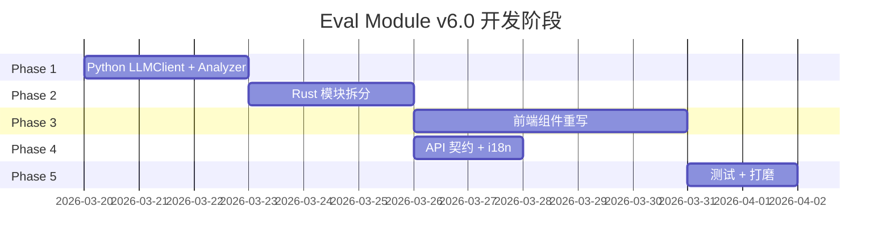

# Eval Module v6.0 重塑 — 实施方案

基于已批准的 [设计文档 v6.0](file:///c:/Own%20Docm/Coding/My-Skills/myskills-manager/docs/plans/Skillar%20Skill%20Evaluator%20%E6%A8%A1%E5%9D%97%E8%AE%BE%E8%AE%A1%E6%96%87%E6%A1%A3.md)，结合当前代码结构和用户痛点，制定分阶段实施方案。

> [!IMPORTANT]
> 本次为**重塑性重构**，用户明确表示可以大胆摒弃现有代码结构。策略为"保留数据契约兼容性，重写组件和模块"。

---

## 当前代码基线

| 层 | 文件 | 行数 | 状态 |
|---|---|---|---|
| Frontend | `EvalPage.tsx` | 3847 | 重写 → 6+ 组件 |
| Frontend | `EvalPage.css` | ~800 | 重写 |
| Backend | `evals.rs` | 7627 | 重构 → 5 模块 |
| Python | `__main__.py` + 4 modules | ~1200 | 重构 + 新增 |
| Tests | 3 eval test files | ~1000 | 更新 + 新增 |

---

## Phase 1: 基础设施 — Python 引擎重构

> 目标：统一 LLM Client，新增 Analyzer 模块，为三角色模型分离铺路

---

### Python Engine

#### [MODIFY] [\_\_main\_\_.py](file:///c:/Own%20Docm/Coding/My-Skills/myskills-manager/src-tauri/py/eval_engine/__main__.py)
- 新增 `analyze` 子命令，接收评测结果 JSON → 输出 analyzer notes + improvement suggestions
- 新增 `--judge-model` / `--judge-api-key` / `--judge-base-url` 参数到 `trigger` 和 `functional` 子命令
- 新增 `--generator-model` 参数到 `generate-samples` 子命令

#### [NEW] [llm\_client.py](file:///c:/Own%20Docm/Coding/My-Skills/myskills-manager/src-tauri/py/eval_engine/llm_client.py)
- 从 `trigger_eval.py` 和 `functional_eval.py` 中提取公共 LLM 调用逻辑
- 封装 `LLMClient` 类：统一 API 调用、重试、JSON 解析、错误处理
- 支持 `openai-compatible` provider（当前）+ 预留扩展口

#### [MODIFY] [trigger\_eval.py](file:///c:/Own%20Docm/Coding/My-Skills/myskills-manager/src-tauri/py/eval_engine/trigger_eval.py)
- 改用 `LLMClient` 替代内联 API 调用
- 支持接收独立的 judge model 配置（用于 complex 环境下的路由判断）
- 返回结果中增加 `trigger_rate`（多轮统计）

#### [MODIFY] [functional\_eval.py](file:///c:/Own%20Docm/Coding/My-Skills/myskills-manager/src-tauri/py/eval_engine/functional_eval.py)
- 改用 `LLMClient` 替代内联 API 调用
- 支持独立 judge model 配置（Layer2 评分由 Judge 模型执行）
- 增强 Layer2 评分输出：加入 `improvement_suggestions` 字段

#### [MODIFY] [sample\_gen.py](file:///c:/Own%20Docm/Coding/My-Skills/myskills-manager/src-tauri/py/eval_engine/sample_gen.py)
- 改用 `LLMClient`
- 支持独立 generator model 配置

#### [NEW] [analyzer.py](file:///c:/Own%20Docm/Coding/My-Skills/myskills-manager/src-tauri/py/eval_engine/analyzer.py)
- 接收完整评测结果 JSON
- 实现 4 步分析：per-assertion 模式 → cross-case 模式 → 效率权衡 → 改进建议
- 输出 `{ analyzer_notes: string[], improvement_suggestions: string[], description_feedback?: string }`

---

## Phase 2: 后端重构 — Rust 模块拆分

> 目标：将 7627 行 `evals.rs` 拆分为可维护的模块结构

---

### Rust Backend

#### [NEW] [evals/mod.rs](file:///c:/Own%20Docm/Coding/My-Skills/myskills-manager/src-tauri/src/evals/mod.rs)
- 模块入口：re-export 所有 Tauri commands
- 注册所有 eval 相关的 Tauri 命令

#### [NEW] [evals/types.rs](file:///c:/Own%20Docm/Coding/My-Skills/myskills-manager/src-tauri/src/evals/types.rs)
- 所有 struct / enum / type 定义
- `EvalPipelineProgressEvent` 增强：新增 `case_statuses: Vec<CaseStatus>` 字段（逐 case 实时状态）
- 新增 `AnalyzerSummary` struct：`notes`, `improvement_suggestions`, `description_feedback`
- 新增 `EvalScorecard` struct：五维得分 + 综合评级 + 雷达图数据

#### [NEW] [evals/pipeline.rs](file:///c:/Own%20Docm/Coding/My-Skills/myskills-manager/src-tauri/src/evals/pipeline.rs)
- 核心管道逻辑：`run_eval_pipeline` 主流程
- 调用 Python sidecar 的流程编排
- 进度事件发射
- 支持 3 种模式分发：Quick / Standard / Full

#### [NEW] [evals/history.rs](file:///c:/Own%20Docm/Coding/My-Skills/myskills-manager/src-tauri/src/evals/history.rs)
- 历史存储 / 加载 / 列表
- 评测结果持久化
- 跨历史对比数据准备

#### [NEW] [evals/analyzer.rs](file:///c:/Own%20Docm/Coding/My-Skills/myskills-manager/src-tauri/src/evals/analyzer.rs)
- 调用 Python analyzer 模块
- 将分析结果注入到 pipeline output 中
- Scorecard 生成逻辑

#### [DELETE] [evals.rs](file:///c:/Own%20Docm/Coding/My-Skills/myskills-manager/src-tauri/src/evals.rs)
- 废弃单文件，由 `evals/` 目录替代

#### [MODIFY] [lib.rs](file:///c:/Own%20Docm/Coding/My-Skills/myskills-manager/src-tauri/src/lib.rs)
- `mod evals;` 改为引用目录模块
- 更新命令注册（新增 analyzer 相关命令）

---

## Phase 3: 前端重构 — 组件拆分 + 新视图

> 目标：重写 `EvalPage.tsx`，从 3847 行单文件拆分为 6+ 独立组件

---

### Frontend 组件

#### [NEW] [eval/EvalStore.ts](file:///c:/Own%20Docm/Coding/My-Skills/myskills-manager/src/pages/eval/EvalStore.ts)
- 全局 eval 状态管理（Context + useReducer 或 Zustand-like 轻量方案）
- 统一管理：config, progress, report, history, view 状态

#### [NEW] [eval/EvalSetup.tsx](file:///c:/Own%20Docm/Coding/My-Skills/myskills-manager/src/pages/eval/EvalSetup.tsx)
- Skill 选择器
- 模式选择 (Quick / Standard / Full)
- **三角色模型配置**：Executor / Judge / Generator
- 数据集管理（生成 / 导入 / 编辑）
- 运行前预估面板

#### [NEW] [eval/EvalRunning.tsx](file:///c:/Own%20Docm/Coding/My-Skills/myskills-manager/src/pages/eval/EvalRunning.tsx)
- **双层进度条**（总体 + 当前阶段）
- **Case 网格**：每个 case 显示为颜色卡片（✅绿/❌红/⏳蓝/⏸灰），实时翻转
- **实时统计面板**：Pass Rate 仪表盘 / Token 计数器 / 耗时计时器
- 可折叠详细日志
- Pause / Resume / Cancel 控件

#### [NEW] [eval/EvalScorecard.tsx](file:///c:/Own%20Docm/Coding/My-Skills/myskills-manager/src/pages/eval/EvalScorecard.tsx)
- **雷达图**：五维得分可视化（ECharts radar）
- **综合评级**：★ 星级 + 数值分
- **增益对比表**：with_skill vs without_skill 的 Delta 高亮
- **Analyzer 洞察卡**：notes + 改进建议列表

#### [NEW] [eval/EvalResult.tsx](file:///c:/Own%20Docm/Coding/My-Skills/myskills-manager/src/pages/eval/EvalResult.tsx)
- Quick 模式的触发结果展示
- 触发详情表格 / 图表（沿用现有逻辑，优化呈现）

#### [NEW] [eval/EvalReview.tsx](file:///c:/Own%20Docm/Coding/My-Skills/myskills-manager/src/pages/eval/EvalReview.tsx)
- Full/Standard 模式的综合审查页
- 嵌入 Scorecard + 分项 Tab（触发 / 功能 / 效率）
- 历史趋势折线图
- Review checklist + 操作按钮

#### [NEW] [eval/EvalHistory.tsx](file:///c:/Own%20Docm/Coding/My-Skills/myskills-manager/src/pages/eval/EvalHistory.tsx)
- 历史记录浮层
- 两次记录 Diff 对比
- 趋势折线图

#### [NEW] [eval/EvalPage.tsx](file:///c:/Own%20Docm/Coding/My-Skills/myskills-manager/src/pages/eval/EvalPage.tsx)
- 新版入口：轻量 Shell，根据 view 状态 dispatch 到子组件
- 替代旧版 `src/pages/EvalPage.tsx`

#### [DELETE] [EvalPage.tsx](file:///c:/Own%20Docm/Coding/My-Skills/myskills-manager/src/pages/EvalPage.tsx)
- 废弃旧版单文件

#### [DELETE] [EvalPage.css](file:///c:/Own%20Docm/Coding/My-Skills/myskills-manager/src/pages/EvalPage.css)
- 废弃旧版样式，各子组件自带样式文件

---

## Phase 4: 数据契约 + API 层

> 目标：更新 TypeScript 类型定义和 Tauri API 调用层

---

#### [MODIFY] [tauri.ts](file:///c:/Own%20Docm/Coding/My-Skills/myskills-manager/src/api/tauri.ts)
- 更新 `EvalPipelineProgressEvent` 类型：新增 `caseStatuses`
- 新增 `EvalScorecard` / `AnalyzerSummary` 类型
- 更新 `runEvalPipeline` request：新增 `judgeModel` / `judgeApiKey` / `judgeBaseUrl` / `generatorModel` 字段
- 新增 `EvalMode = "quick" | "standard" | "full"` Union（加入 standard）
- 更新 camelCase ↔ snake_case 映射

#### [MODIFY] [messages.ts](file:///c:/Own%20Docm/Coding/My-Skills/myskills-manager/src/i18n/messages.ts)
- 新增 Scorecard / Analyzer / Standard 模式等 i18n keys（中英双语）
- 新增三角色模型配置标签
- 新增 case 状态标签

---

## Phase 5: 集成测试 + 视觉打磨

> 目标：端到端验证 + 视觉优化

---

#### [MODIFY] 现有 3 个 eval 测试文件
- `evalPipelineApi.test.ts` — 更新类型契约断言（新增 judge/generator model, analyzer, scorecard）
- `evalModeEffect.test.ts` — 新增 standard 模式断言，组件拆分路径断言
- `evalRunningProgressUx.test.ts` — 新增 case-level progress 断言

#### [NEW] evalScorecardView.test.ts
- 验证 Scorecard 组件存在且包含雷达图 / 评级 / delta 对比
- 验证 Analyzer notes 渲染

#### [NEW] evalAnalyzerPipeline.test.ts
- 验证 `analyze` 子命令在 `__main__.py` 中注册
- 验证 `analyzer.py` 模块存在且输出结构符合契约

---

## 实施顺序



---

## Verification Plan

### Automated Tests

运行命令：
```powershell
# 在项目根目录执行
cd "c:\Own Docm\Coding\My-Skills\myskills-manager"

# 运行所有前端测试（node:test runner）
npx tsx --test test/eval*.test.ts

# 运行 TypeScript 类型检查
npx tsc -b --noEmit

# 运行 Rust 编译检查
cd src-tauri && cargo check
```

### Manual Verification

1. **`npm run dev` 启动开发服务器** → 切换到 Eval 页面
2. **验证 Setup 视图** → 能看到 Quick/Standard/Full 三种模式 + 三个模型选择下拉
3. **验证 Running 视图** → 启动评测后能看到 case 网格实时翻转、进度条、统计面板
4. **验证 Result/Review 视图** → 评测完成后能看到 Scorecard 雷达图、Analyzer notes、增益 Delta 表
5. **验证 History** → 历史记录能加载、两次结果能对比

> [!WARNING]
> 手动验证需要配置有效的 LLM API Key。如果没有，可以通过 mock 数据验证 UI 渲染。

---

## 风险与回退策略

| 风险 | 缓解措施 |
|---|---|
| Rust 模块拆分可能导致编译错误 | 逐步迁移，每拆完一个模块跑 `cargo check` |
| 现有 47 个测试可能因路径变更失败 | 测试断言引用的路径需要同步更新 |
| Python analyzer 在弱模型上输出质量差 | 预设 fallback：如果 analyzer 调用失败/超时，跳过分析但不阻塞报告 |
