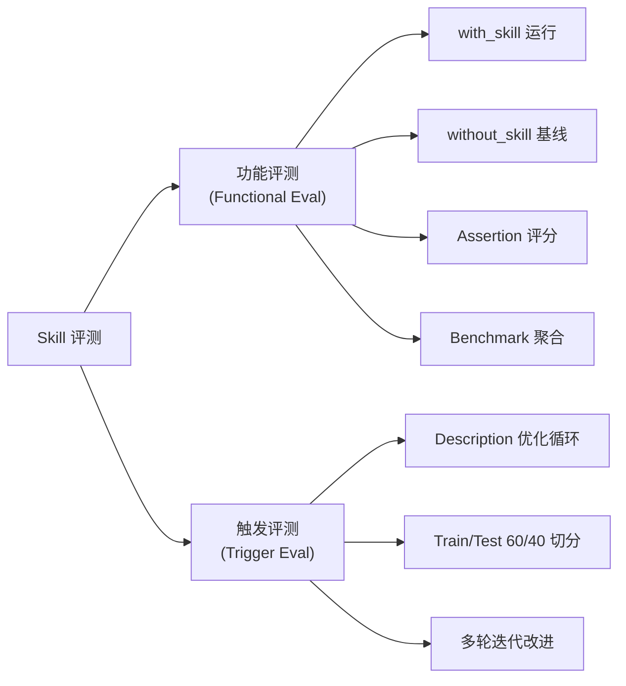

# Skill-Creator 最新版评测方法调研报告

## 概览

最新版 [skill-creator](https://github.com/anthropics/skills/tree/main/skills/skill-creator) (来自 `anthropics/skills` 官方仓库) 已经从我们本地安装的"简单验证"版本进化为一套**完整的评测驱动开发框架**。

> [!IMPORTANT]
> 我们本地安装的 skill-creator **只有** `SKILL.md` 一个文件，缺少 `scripts/`、`agents/`、`eval-viewer/`、`references/`、`assets/` 等关键目录。

---

## 最新版目录结构

```
skill-creator/
├── SKILL.md                           # 主文档（大幅扩展，含完整评测流程）
├── agents/
│   ├── grader.md                      # 评分 Agent 指令（8步评分流程）
│   ├── analyzer.md                    # 分析 Agent 指令（benchmark分析 + 盲比较分析）
│   ├── comparator.md                  # 比较 Agent 指令（盲比较两版 skill）
│   └── openai.yaml                    # UI 元数据
├── scripts/
│   ├── run_eval.py                    # 触发评估（核心）
│   ├── run_loop.py                    # Description 优化循环
│   ├── aggregate_benchmark.py         # 基准聚合（统计分析）
│   ├── generate_report.py            # HTML 报告生成
│   ├── quick_validate.py             # 结构验证（我们已有的）
│   ├── improve_description.py        # Description 改进建议
│   ├── package_skill.py              # 打包 .skill 文件
│   ├── init_skill.py                 # 初始化新 Skill
│   └── utils.py                      # 公共工具函数
├── eval-viewer/
│   └── generate_review.py            # 交互式 HTML 评测结果查看器
├── references/
│   ├── schemas.md                     # 6个 JSON schema 定义
│   └── openai_yaml.md                # openai.yaml 字段说明
└── assets/
    └── eval_review.html              # 触发评测集审核 HTML 模板
```

---

## 评测体系架构

### 两大评测维度



---

## 一、功能评测 (Functional Eval)

### 评测流程（5步）

| 步骤 | 内容 | 关键特点 |
|:---|:---|:---|
| **Step 1** | 并行启动 with_skill + baseline 子Agent | 同一 turn 内并行启动所有运行，不分批 |
| **Step 2** | 运行期间起草 Assertions | 利用等待时间写断言，而非空等 |
| **Step 3** | 捕获 timing 数据 | 从 task notification 中提取 `total_tokens`、`duration_ms` |
| **Step 4** | 评分 + 聚合 + 启动 Viewer | Grader Agent → Benchmark → Analyzer → HTML Viewer |
| **Step 5** | 读取用户反馈 | 从 `feedback.json` 获取定性评价 |

### 评分 Agent (grader.md) — 8步流程

1. **读取 Transcript** — 完整阅读执行日志
2. **检查输出文件** — 实际打开/验证产出物
3. **逐条评估 Assertion** — PASS/FAIL + 引用证据
4. **提取/验证 Claims** — 超越预设断言，发现隐含问题
5. **读取 User Notes** — executor 的不确定性记录
6. **批评 Eval 本身** — 判断断言是否有区分力
7. **写入 grading.json** — 结构化输出
8. **读取 Metrics/Timing** — execution_metrics + timing

### Benchmark 聚合 (`aggregate_benchmark.py`)

- 从 `with_skill/` 和 `without_skill/` 目录收集 `grading.json`
- 计算 **mean ± stddev / min / max** for:
  - pass_rate
  - time_seconds
  - tokens
- 输出 **delta** (差异) 对比
- 生成 `benchmark.json` + `benchmark.md`

### 分析 Agent (analyzer.md) — 6步

1. 读取 benchmark.json
2. 分析每个 Assertion 的模式（总是通过？总是失败？高方差？）
3. 跨 Eval 模式分析
4. 分析 Metrics 模式（时间/token/tool_calls）
5. 生成 Notes（数据驱动的洞察）
6. 写入 notes 到 benchmark.json

### Eval Viewer (HTML)

- **Outputs Tab**: 逐 case 查看 prompt / output / 上轮 output / formal grades / feedback
- **Benchmark Tab**: 统计汇总对比、per-eval 细分
- 支持 `--previous-workspace` 做跨迭代对比
- 支持 `--static` 生成独立 HTML

---

## 二、触发评测 (Trigger Eval) + Description 优化

### `run_eval.py` — 触发检测核心

```python
# 核心思路：通过 `claude -p` 启动实际的 Claude 会话
# 将 skill 注册为 .claude/commands/ 下的命令文件
# 监听 stream event 检测 skill 是否被触发

claude -p "<query>" --output-format stream-json --verbose --include-partial-messages
```

**关键特性：**
- 通过 `ProcessPoolExecutor` 并行运行多个查询
- 支持 `runs_per_query`（默认3轮）+ `trigger_threshold`（默认0.5）
- 通过 stream event（`content_block_start` → `tool_use`）**提前检测**触发，无需等完整响应
- 结果：每个 query 的 `trigger_rate`、`pass/fail`

### `run_loop.py` — Description 优化循环

```
60% train / 40% held-out test split
→ 评估当前 description (每 query 3 次)
→ LLM 分析失败案例 → 提出改进建议
→ 在 train + test 上重新评估
→ 最多 5 轮迭代
→ 以 test score 选择 best_description（避免过拟合）
```

---

## 三、与我们 Eval Module 的关键差异

| 维度 | Anthropic skill-creator | 我们的 Eval Module |
|:---|:---|:---|
| **评测执行方式** | 调用 `claude -p` 启动真实 Agent 会话 | 通过 Python sidecar 直接调 LLM API |
| **触发评测** | 注册为 `.claude/commands/` → 检测 stream event | 构建路由 prompt → LLM判断选择哪个skill |
| **功能评测** | 执行子Agent → 检查实际输出文件 | LLM模拟执行 → 文本层面检查 |
| **评分机制** | Grader Agent（实际检查文件和transcript, 8步） | Layer1 启发式 + Layer2 LLM 评分 |
| **Benchmark** | mean/stddev + delta + analyzer notes | 简单 pass_rate + quality_mean |
| **人类反馈** | 交互式 HTML Viewer + feedback.json | 无 |
| **Description优化** | 自动化循环（train/test split, 5轮） | 无 |
| **迭代管理** | iteration-N/ 目录 + history.json + previous workspace | evalHistory + runHistory |
| **LLM Provider** | 只用 `claude -p`（通过 CLI） | 只用 openai-compatible API |

---

## 四、对我们 Eval 模块优化的启示

### 可直接借鉴的设计

1. **Benchmark 聚合** — 增加 mean ± stddev 统计，加入 token/time delta 对比
2. **Analyzer Notes** — 自动分析 per-assertion 模式（非区分性断言、高方差case）
3. **Description 优化循环** — train/test split + 自动化迭代
4. **Eval Feedback** — 自动批评断言的区分力
5. **User Feedback 闭环** — 收集人类反馈并纳入改进循环

### 不直接适用但可参考的理念

1. **真实 Agent 执行** — skill-creator 用 `claude -p` 启动真实会话，我们的桌面应用更适合 API 调用方式
2. **Claims 提取/验证** — 超越预设断言，主动发现输出中的隐含问题
3. **迭代管理** — 用 iteration-N/ + history.json 管理版本进化，比我们的时间戳文件夹更清晰
