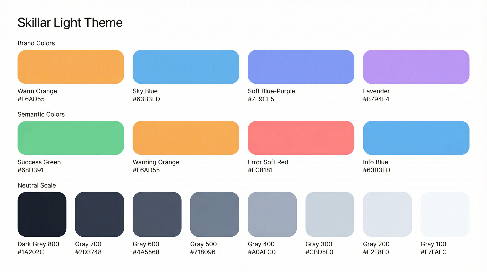
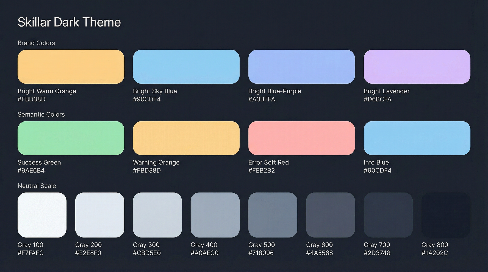

# Skillar Design System (v1.0)

**基于柔和方案（F）配色**

---

## 1. 核心理念

Skillar 的设计系统遵循**柔和、清晰、一致**的原则。我们旨在创造一个既专业又具亲和力的用户界面，让用户在管理和同步技能时感到轻松和专注。

- **柔和 (Soft)**：采用低饱和度、柔和的色彩，避免刺眼的对比，营造舒适的视觉环境。
- **清晰 (Clear)**：通过明确的视觉层级和一致的交互模式，确保信息传达的准确性。
- **一致 (Consistent)**：在整个应用中保持统一的视觉语言和交互行为，降低用户的学习成本。

## 2. Logo

Logo 是品牌识别的核心。我们采用柔和方案（F）配色，石墨灰三角形搭配暖橙、天蓝、淡蓝紫、薰衣草四色光线，传达"统一分发"的核心概念。

| 白底版 | 透明底版 |
| :--- | :--- |
|  |  |

## 3. 色彩系统

色彩系统定义了应用界面的整体观感，分为浅色和深色两套主题。

### 3.1 浅色主题 (Light Theme)

#### 语义色彩

| 角色 | 色值 | 用途 |
| :--- | :--- | :--- |
| **Primary** | #7F9CF5 | 主按钮、选中态、导航高亮 |
| **Secondary** | #B794F4 | 次要按钮、标签、徽章 |
| **Accent** | #F6AD55 | CTA 按钮、重要提示、新功能标记 |
| **Info** | #63B3ED | 信息提示、链接、帮助文本 |
| **Success** | #68D391 | 同步成功、状态正常 |
| **Warning** | #F6AD55 | 警告提示（复用 Accent） |
| **Error** | #FC8181 | 错误状态、删除操作 |

#### 中性色阶梯

| 名称 | 色值 | 用途 |
| :--- | :--- | :--- |
| Gray-900 | #1A202C | 主文字 |
| Gray-800 | #2D3748 | 标题文字（= Logo 三角形色） |
| Gray-700 | #4A5568 | 次要文字 |
| Gray-600 | #718096 | 占位符文字 |
| Gray-400 | #A0AEC0 | 禁用态文字 |
| Gray-200 | #E2E8F0 | 边框、分割线 |
| Gray-100 | #EDF2F7 | 卡片背景、hover 态 |
| Gray-50 | #F7FAFC | 页面背景 |

### 3.2 深色主题 (Dark Theme)

#### 语义色彩（已提亮）

| 角色 | 色值 | 用途 |
| :--- | :--- | :--- |
| **Primary** | #A3BFFA | 主按钮、选中态、导航高亮 |
| **Secondary** | #D6BCFA | 次要按钮、标签、徽章 |
| **Accent** | #FBD38D | CTA 按钮、重要提示、新功能标记 |
| **Info** | #90CDF4 | 信息提示、链接、帮助文本 |
| **Success** | #9AE6B4 | 同步成功、状态正常 |
| **Warning** | #FBD38D | 警告提示（复用 Accent） |
| **Error** | #FEB2B2 | 错误状态、删除操作 |

#### 中性色阶梯

| 名称 | 色值 | 用途 |
| :--- | :--- | :--- |
| Gray-50 | #F7FAFC | 主文字 |
| Gray-100 | #E2E8F0 | 标题文字 |
| Gray-200 | #CBD5E0 | 次要文字 |
| Gray-400 | #A0AEC0 | 占位符文字 |
| Gray-600 | #718096 | 禁用态文字 |
| Gray-700 | #4A5568 | 边框、分割线 |
| Gray-800 | #2D3748 | 卡片背景、hover 态 |
| Gray-900 | #1A202C | 页面背景 |

## 4. 排版规范

我们选用无衬线字体 Inter，以确保在各种屏幕尺寸和分辨率下的可读性。

| 元素 | 字重 | 大小 | 行高 |
| :--- | :--- | :--- | :--- |
| **Page Title** | 700 (Bold) | 24px | 32px |
| **Card Title** | 600 (SemiBold) | 20px | 28px |
| **Section Title** | 600 (SemiBold) | 18px | 24px |
| **Body** | 400 (Regular) | 16px | 24px |
| **Small Text** | 400 (Regular) | 14px | 20px |
| **Button** | 500 (Medium) | 16px | 24px |

## 5. 组件规范

### 5.1 圆角

圆角是柔和设计语言的重要组成部分，与 Logo 的圆角三角形保持一致。

- **小组件 (按钮, 输入框, 标签)**: 8px
- **卡片 (Card)**: 12px
- **模态框 (Modal)**: 16px

### 5.2 阴影

阴影应柔和且带有蓝调，避免使用纯黑色阴影。

- **标准阴影**: `0 4px 12px rgba(127, 156, 245, 0.08)`
- **大型阴影**: `0 8px 24px rgba(127, 156, 245, 0.12)`

### 5.3 按钮

| 类型 | 背景色 | 文字色 | 边框 |
| :--- | :--- | :--- | :--- |
| **Primary** | Primary | White | 无 |
| **Secondary** | Transparent | Secondary | 1px solid Secondary |
| **Accent (CTA)** | Accent | Gray-900 | 无 |
| **Destructive** | Error | White | 无 |
| **Disabled** | Gray-200 | Gray-400 | 无 |

---

**文档版本**: 1.0
**最后更新**: 2026-03-04
